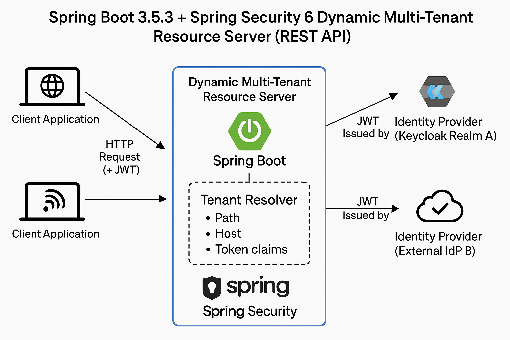
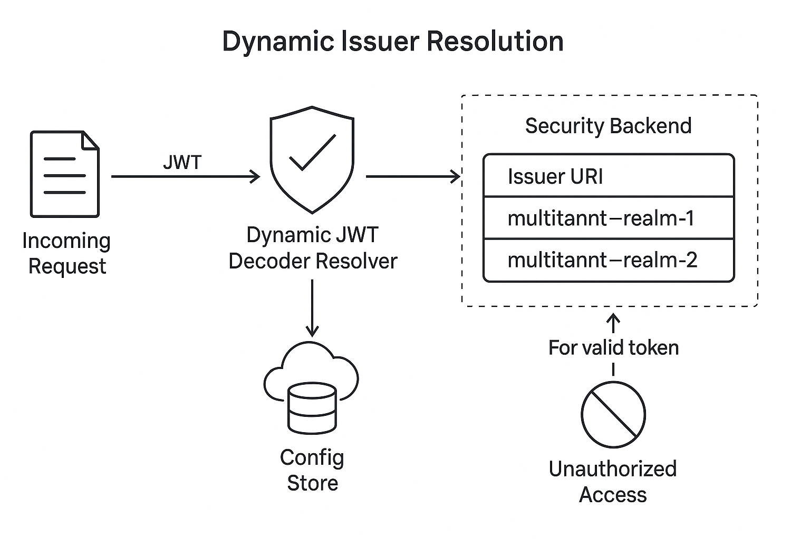

# Spring Boot 3.5.3 Spring Security 6 Dynamic Multi Tenant Resource Server (REST API)

---

## 🌐 Spring Boot 3.5.3 + Spring Security 6 Dynamic Multi-Tenant Resource Server (REST API)

This project demonstrates a **modern, production-ready REST API** built using **Spring Boot 3.5.3** and **Spring Security 6**, designed to function as a **Dynamic Multi-Tenant OAuth2 Resource Server**. It securely protects API endpoints using **JWT-based authentication**, with support for **multiple identity providers and realms**, each mapped to distinct tenants at runtime.

By leveraging Spring's flexible security architecture and recent improvements in multi-tenant support, this application dynamically resolves the correct **OAuth2 issuer, public keys (JWKS), and tenant-specific authentication rules** per incoming request. It enables seamless token validation and access control in a **multi-tenant SaaS environment** without redeploying or statically configuring tenants.

### 🔑 Key Features

* 🔁 **Dynamic Issuer Resolution** per request (e.g., by domain, header, or token content)
* 🛡️ **OAuth2 JWT Validation** via Spring Security’s Resource Server module
* 🏢 **Multi-Tenant Ready**: Each tenant can be backed by its own Keycloak realm or external IdP
* 🧩 **Pluggable Tenant Resolver Strategy** (path-based, host-based, or token claims)
* ⚙️ **Extensible Security Context** based on tenant, roles, scopes
* 📊 **Actuator & Monitoring** support for health checks and observability

This resource server forms a **crucial backend security layer** in microservice ecosystems where tenants share the infrastructure but require isolated authentication domains. Ideal for B2B SaaS platforms, GovCloud, and industry-specific identity zones.

---

## System Architecture




# Building

---

## 🧱 Project Build Configuration (`pom.xml`)

This project uses **Maven** to build and manage a Spring Boot 3.5.3 application that acts as a **multi-tenant OAuth2 Resource Server** using **Spring Security 6**.

### 📌 Project Metadata

| Element      | Value                                                                             |
| ------------ | --------------------------------------------------------------------------------- |
| Group ID     | `com.manh`                                                                        |
| Artifact ID  | `spring-boot-3-5-3-spring-security-6-oauth2-multitenant-rest-api-resource-server` |
| Spring Boot  | `3.5.3`                                                                           |
| Java Version | `17`                                                                              |
| Description  | Demo project for multitenant OAuth2-secured REST APIs                             |

---

### ⚙️ Dependencies Overview

| Dependency                                   | Purpose                                                             |
| -------------------------------------------- | ------------------------------------------------------------------- |
| `spring-boot-starter-actuator`               | Adds production-ready endpoints for health, metrics, and monitoring |
| `spring-boot-starter-data-jpa`               | Enables integration with relational databases via Spring Data JPA   |
| `spring-boot-starter-web`                    | Provides REST API support with embedded Tomcat                      |
| `spring-boot-starter-security`               | Core Spring Security module                                         |
| `spring-boot-starter-oauth2-resource-server` | Enables JWT-based OAuth2 Resource Server (validates access tokens)  |
| `spring-security-oauth2-jose`                | Adds support for JOSE (JWT, JWS, JWE) token parsing and validation  |
| `jackson-annotations`                        | Jackson annotations for serializing/deserializing JSON models       |
| `jackson-datatype-jsr310`                    | Support for Java 8+ `java.time` API in JSON                         |
| `nimbus-jose-jwt`                            | Low-level JOSE/JWT parsing (used under the hood by Spring Security) |
| `mysql-connector-j` (runtime)                | MySQL JDBC driver for production use                                |
| `spring-boot-starter-test` (test)            | Unit and integration testing support with JUnit 5                   |
| `spring-security-test` (test)                | Spring Security-specific test helpers for mocking auth scenarios    |

---

### 🔧 Build Plugin

| Plugin                     | Role                                             |
| -------------------------- | ------------------------------------------------ |
| `spring-boot-maven-plugin` | Enables Spring Boot packaging and executable JAR |

This plugin auto-configures Spring Boot application entrypoints and dependencies during the build process, simplifying deployment and execution.

---

### 💡 Key Highlights

* **Spring Security 6** ensures modern OAuth2 support with clear separation between client, resource server, and authorization server roles.
* **JOSE/JWT support** through `nimbus-jose-jwt` and `spring-security-oauth2-jose` ensures secure and standards-compliant token validation.
* **MySQL integration** using Spring Data JPA and `mysql-connector-j` enables multi-tenant or customer-specific data access patterns.
* **Actuator endpoints** can expose metrics for readiness/liveness probes in Kubernetes or monitoring with Prometheus/Grafana.

---

### ✅ Minimum Java Version

```xml
<properties>
    <java.version>17</java.version>
</properties>
```

The project uses **Java 17**, the long-term support (LTS) release compatible with Spring Boot 3.x.

---

# Seeing a Demo

# Configuration Properties

## Default Profile

This configuration file is a typical `application.properties` setup in a Spring Boot project—especially one using Spring Security, Spring Data JPA, OAuth2, and Spring Batch. Let's break it down section by section.

---

### ✅ **Application Name**

```properties
spring.application.name=spring-boot-3-5-3-spring-security-6-oauth2-multitenant-rest-api-resource-server
```

* This sets the Spring application’s name. Useful for logs, monitoring, or service discovery (if using something like Spring Cloud/Consul).
* Describes the tech stack in use:

    * Spring Boot 3.5.3
    * Spring Security 6
    * OAuth2 support
    * Multitenant RESTless (probably token-authenticated) API
    * Acts as a **Resource Server** in an OAuth2 system.

---

### ✅ **Spring Datasource Configuration**

```properties
spring.datasource.url=jdbc:mysql://localhost:3306/customerdb
spring.datasource.username=root
spring.datasource.password=localroot
spring.datasource.driver-class-name=com.mysql.cj.jdbc.Driver
```

* Configures a **MySQL database** named `customerdb`.
* Uses `root` user with password `localroot`.
* Specifies the modern MySQL 8 JDBC driver (`com.mysql.cj.jdbc.Driver`).

> You can add optional query params like:
> `?useSSL=false&serverTimezone=UTC`
> to avoid SSL/timezone warnings in MySQL 8+.

---

### ✅ **JPA / Hibernate**

```properties
spring.jpa.hibernate.ddl-auto=update
spring.jpa.show-sql=true
spring.jpa.properties.hibernate.dialect=org.hibernate.dialect.MySQL8Dialect
```

* `ddl-auto=update` → Automatically updates the schema to match entity classes.
  ⚠️ **Great for dev, dangerous in prod** (could lead to data loss).
* `show-sql=true` → Logs all SQL statements to the console.
* `MySQL8Dialect` → Optimizes Hibernate for MySQL 8.

---


### ✅ **Logging**

```properties
logging.level.org.springframework.jdbc.core=DEBUG
logging.level.org.springframework.batch=INFO
logging.file.name=logs/batch-job.log
spring.sql.init.mode=always
```

* Enables detailed logging for SQL operations and Spring Batch.
* Logs are saved to `logs/batch-job.log`.
* `spring.sql.init.mode=always` → Ensures that SQL init scripts (like `schema.sql` or `data.sql`) run at startup.

---

### ✅ **Server Port**

```properties
server.port=9090
```

* Runs the Spring Boot app on port **9090** instead of the default 8080.

---

### 📝 **Final Notes**

* This project appears to be a **multi-tenant, OAuth2-secured Spring Batch Resource Server** using MySQL and JPA.
* The config supports:

    * Auto schema update,
    * Batch job tracking,
    * Debug logging,
    * SQL script initialization,
    * Dynamic port setup,
    * Tenant-based password encoding (if used with custom encoders),
    * REST API + OAuth2 Resource Server behavior.


## Default application.yml

This YAML configuration snippet defines a **multi-tenant security setup**—likely for a Spring Boot or Quarkus-based OAuth2 Resource Server. Here's an explanation of each part:

---

### 🔐 `security` Configuration Block

This is a **custom configuration namespace** (not native to Spring Security), typically mapped to a configuration class using `@ConfigurationProperties(prefix = "security")`.

#### ✅ `issuers`

```yaml
issuers:
  tenant01: http://0.0.0.0:8080/realms/multitannt-realm-1
  tenant02: http://0.0.0.0:8080/realms/multitannt-realm-2
```

* Defines **tenant-specific Keycloak realms** or OIDC issuers.
* `tenant01` maps to `multitannt-realm-1`
* `tenant02` maps to `multitannt-realm-2`
* These URIs are used to:

    * Discover the public keys (via `/.well-known/openid-configuration`)
    * Validate incoming JWT tokens based on the `iss` (issuer) claim
    * Associate each token with the correct tenant realm.

#### ✅ `mode`

```yaml
mode: STATIC
```

* Indicates how issuer-to-tenant mappings are handled:

    * `STATIC`: issuer URIs are hardcoded in the YAML (as above).
    * `DYNAMIC`: issuer mappings are resolved at runtime (e.g., from a database, or discovered dynamically per request).
    * This value is often referenced inside a `JwtDecoderRegistry`, `TenantAuthenticationFilter`, or a custom `AuthenticationManagerResolver`.

---

### 🏗️ Example Usage in Java (Spring Boot)

This config would typically back a component like:

```
@ConfigurationProperties(prefix = "security")
public class SecurityProperties {
    private Map<String, String> issuers;
    private String mode;
    // getters and setters
}
```

Then used in dynamic JWT decoding:

```
JwtDecoder resolveDecoder(HttpServletRequest request) {
    String tenantId = extractTenantId(request);
    String issuerUri = securityProperties.getIssuers().get(tenantId);
    return JwtDecoders.fromIssuerLocation(issuerUri);
}
```

---

### 🧩 When to Use `DYNAMIC`

Switching `mode` to `DYNAMIC` is useful when:

* New tenants are added without redeploying the app.
* Issuer URIs are discovered from a config server or database.
* You use `AuthenticationManagerResolver<HttpServletRequest>` in Spring or similar `SecurityIdentityProvider` logic in Quarkus.

## Adding Issuer Dynamically




## Spring Dynamic Profile

``` 
security:
  issuers:
    tenant01: http://0.0.0.0:8080/realms/multitannt-realm-1
    tenant02: http://0.0.0.0:8080/realms/multitannt-realm-2
  mode: DYNAMIC # or DYNAMIC
```
# Java Code

## IssuerProperties

The class `IssuerProperties` is a Spring Boot configuration properties holder that binds to custom YAML or `.properties` entries prefixed with `security`. Here's a breakdown of its purpose and functionality:

---

### 🔍 Purpose

This class enables the dynamic or static configuration of tenant-specific **OAuth2/OIDC issuer URLs** for a **multi-tenant resource server**.

It's part of a setup where each tenant (e.g., `tenant01`, `tenant02`) has its own Keycloak realm (or other OIDC provider), and the application dynamically resolves which issuer to use when validating JWT tokens.

---

### 🔧 Annotations and Features

#### `@Configuration`

Marks this class as a Spring-managed configuration bean.

#### `@ConfigurationProperties(prefix = "security")`

This tells Spring Boot to map external configuration values (e.g., in `application.yml`) under the `security` prefix into this class.

---

### 🔐 Properties It Maps

#### Example YAML:

```yaml
security:
  issuers:
    tenant01: http://localhost:8080/realms/tenant01-realm
    tenant02: http://localhost:8080/realms/tenant02-realm
  mode: DYNAMIC
```

---

### 🔑 Fields

#### `Map<String, String> issuers`

* Maps tenant IDs (e.g., `tenant01`) to their corresponding issuer URIs (i.e., the base URL of their OIDC realm).
* Used during JWT decoding to determine which `JwtDecoder` to use per tenant.

#### `TenantMode mode`

* An enum (likely defined in `com.rollingstone.security.TenantMode`) that defines how tenant resolution should be handled.
* Possible values: `STATIC` or `DYNAMIC`.

  * `STATIC`: issuer mapping is hard-coded and known in advance.
  * `DYNAMIC`: issuers might be discovered at runtime, possibly from a DB or a Consul-like registry.

---

### 📦 Typical Usage in Application

This class would be injected into a bean such as a custom `JwtDecoder` resolver, so that token validation can be tenant-aware:

```
@Autowired
IssuerProperties issuerProperties;

String tenant = extractTenantFromHeader(request);
String issuer = issuerProperties.getIssuers().get(tenant);
```

---

### ✅ Summary

| Field     | Type                  | Description                                              |
| --------- | --------------------- | -------------------------------------------------------- |
| `issuers` | `Map<String, String>` | Maps tenant identifiers to their respective OIDC issuers |
| `mode`    | `TenantMode`          | Specifies resolution strategy: STATIC or DYNAMIC         |

This enables a **multi-tenant OAuth2 Resource Server** to correctly and securely validate tokens based on the originating issuer for each tenant.

## RestlessConfig (I was a little RestLess to write this one)

This `RestLessConfig` class is a Spring Boot `@Configuration` class that defines two important beans: a customized `ObjectMapper` and a `JwtAuthenticationConverter`. These help the application correctly handle:

1. **Deserialization of modern Java time types** (like `LocalDateTime`)
2. **Mapping JWT claims to Spring Security authorities**

---

## 🔍 Breakdown of the Class

```
@Configuration
public class RestLessConfig {
```

This annotation tells Spring to treat this class as a source of bean definitions for the application context.

---

## 🧩 Bean 1: `ObjectMapper` (for JSON)

```
@Bean
public ObjectMapper objectMapper() {
    ObjectMapper mapper = new ObjectMapper();
    mapper.registerModule(new JavaTimeModule());
    return mapper;
}
```

### ✅ Purpose:

* Provides a customized Jackson `ObjectMapper` to handle JSON serialization/deserialization of Java 8+ date/time types like `LocalDate`, `Instant`, `ZonedDateTime`, etc.

### 🔍 Why `JavaTimeModule`?

* The default Jackson setup does **not** handle `java.time.*` classes out-of-the-box.
* This line ensures proper parsing/formatting of modern date/time values in REST APIs and databases:

```
mapper.registerModule(new JavaTimeModule());
```

---

## 🔐 Bean 2: `JwtAuthenticationConverter`

```
@Bean
public JwtAuthenticationConverter jwtAuthenticationConverter() {
    JwtGrantedAuthoritiesConverter authoritiesConverter = new JwtGrantedAuthoritiesConverter();
    authoritiesConverter.setAuthorityPrefix("ROLE_");
    authoritiesConverter.setAuthoritiesClaimName("realm_access.roles");

    JwtAuthenticationConverter converter = new JwtAuthenticationConverter();
    converter.setJwtGrantedAuthoritiesConverter(authoritiesConverter);
    return converter;
}
```

### ✅ Purpose:

Converts JWT claims into Spring Security roles so that access control (`@PreAuthorize`, `.hasRole()`, etc.) works correctly.

### 🔍 Key Elements:

| Element                                         | Purpose                                                                |
| ----------------------------------------------- | ---------------------------------------------------------------------- |
| `setAuthorityPrefix("ROLE_")`                   | Ensures all roles are prefixed (Spring expects `ROLE_X` format)        |
| `setAuthoritiesClaimName("realm_access.roles")` | Extracts user roles from nested JWT claim (as used in Keycloak)        |
| `JwtAuthenticationConverter`                    | Converts JWT tokens into `Authentication` objects for security context |

### 🔄 Example JWT Claim It Maps:

```
{
  "realm_access": {
    "roles": ["admin", "user"]
  }
}
```

Would result in:

```
GrantedAuthority("ROLE_admin")
GrantedAuthority("ROLE_user")
```

---

## ✅ Summary

| Bean                         | Purpose                                                                     |
| ---------------------------- | --------------------------------------------------------------------------- |
| `ObjectMapper`               | Allows correct parsing of Java 8+ date/time types (`LocalDateTime`, etc.)   |
| `JwtAuthenticationConverter` | Maps roles from `realm_access.roles` claim into Spring Security authorities |

This setup is **very common when integrating Spring Security with Keycloak or any JWT-based OIDC provider** where roles are nested under a custom claim.

## DynamicIssuerRegistry

The `DynamicIssuerRegistry` class is a Spring `@Component` designed to **manage and resolve tenant-specific OAuth2/OIDC issuers** in a **multi-tenant** system, typically used in **dynamic resource server validation** setups (like with Keycloak realms per tenant).

---

### 🔍 **Purpose**

To act as a **registry** (in-memory cache) that maps **tenant identifiers** to their respective **OIDC issuer URLs**, and enables:

* **Static initialization** (at app startup)
* **Dynamic registration** (at runtime)
* **Runtime lookup** of issuer by tenant or JWT claim

---

### 🧱 **Code Breakdown**

```
private final Map<String, String> tenantToIssuer = new ConcurrentHashMap<>();
```

* Stores mappings:
  `tenantId → issuerUrl`
* `ConcurrentHashMap` ensures **thread-safety** for concurrent reads/writes.

---

### ✅ **Method: `initializeWithStaticIssuers(Map<String, String>)`**

```
public void initializeWithStaticIssuers(Map<String, String> staticIssuers) {
    tenantToIssuer.putAll(staticIssuers);
}
```

* Called during startup to load issuer mappings from static config (`application.yml`, `IssuerProperties`, etc.)
* Example:

  ```yaml
  security:
    issuers:
      tenant01: http://localhost:8080/realms/tenant01
      tenant02: http://localhost:8080/realms/tenant02
  ```

---

### ✅ **Method: `register(String tenantId, String issuerUrl)`**

```
public void register(String tenantId, String issuerUrl) {
    tenantToIssuer.put(tenantId, issuerUrl);
}
```

* Used at runtime to **dynamically add/update** an issuer mapping (e.g., from a provisioning API or tenant onboarding flow)

---

### ✅ **Method: `resolveIssuer(String issuerClaim)`**

```
public String resolveIssuer(String issuerClaim) {
    return tenantToIssuer.values().stream()
        .filter(issuerClaim::equals)
        .findFirst()
        .orElseThrow(() -> new IllegalArgumentException("Issuer not registered: " + issuerClaim));
}
```

* Used to **validate** if an incoming JWT’s `iss` claim matches one of the registered issuer URLs.
* Fails if the JWT is issued by an **unrecognized tenant**.

---

### ✅ **Method: `getAllIssuers()`**

```
public Map<String, String> getAllIssuers() {
    return Map.copyOf(tenantToIssuer);
}
```

* Returns an **immutable view** of the registered tenant→issuer mappings for inspection, debugging, or health checks.

---

### 📌 **Common Usage Context**

* In a **Spring Boot OAuth2 Resource Server** that handles multiple Keycloak realms.
* Backed by classes like:

  * `IssuerProperties` (static config)
  * `DynamicJwtDecoderFactory` (resolves `JwtDecoder` per issuer)
  * `TenantJwtAuthenticationFilter` (extracts tenant or issuer from request headers/token)

---

### 🧠 **Summary Table**

| Method                        | Purpose                                                       |
| ----------------------------- | ------------------------------------------------------------- |
| `initializeWithStaticIssuers` | Load tenant→issuer mappings from `application.yml` at startup |
| `register`                    | Register new tenant issuer dynamically at runtime             |
| `resolveIssuer`               | Verify if incoming JWT `iss` is a valid/known issuer          |
| `getAllIssuers`               | Expose current mappings (read-only view)                      |

This pattern supports both **static (pre-configured)** and **dynamic (runtime-extensible)** multi-tenant setups for **JWT validation in a secure and scalable way**.

## JwtHelper
The `JwtHelper` class provides a **utility method to extract the `iss` (issuer) claim** from a raw **JWT access token string**. This is particularly useful in **multi-tenant Spring Security resource servers**, where issuer-based routing or validation is needed.

---

### 🔍 **Class Overview**

```
public class JwtHelper {
    public static String extractIssuer(String token) {
        try {
            SignedJWT jwt = (SignedJWT) JWTParser.parse(token);
            return jwt.getJWTClaimsSet().getIssuer();
        } catch (Exception e) {
            throw new RuntimeException("Unable to parse JWT", e);
        }
    }
}
```

---

### 🔧 **How It Works**

1. **Parses the raw JWT string** using `nimbus-jose-jwt`'s `JWTParser`.
2. Casts the result to a `SignedJWT` (assumes the JWT is signed).
3. Retrieves the issuer claim (`iss`) from the JWT payload (`JWTClaimsSet`).
4. Returns the issuer URL as a `String`.

---

### ✅ **Example Usage**

```
String token = "eyJhbGciOiJSUzI1NiIsInR5cCI6IkpXVCJ9..."; // JWT from Authorization header
String issuer = JwtHelper.extractIssuer(token);
System.out.println("Token Issuer: " + issuer);
```

---

### 📦 **Typical Use Cases**

| Scenario                               | Role of `JwtHelper.extractIssuer`                           |
| -------------------------------------- | ----------------------------------------------------------- |
| 🧭 Dynamic tenant resolution           | Helps look up the tenant based on the JWT issuer (`iss`)    |
| 🧾 Token introspection                 | Validates incoming token's source before calling remote IdP |
| 🔐 Resource server multi-realm support | Used in combination with a `DynamicJwtDecoderFactory`       |

---

### ⚠️ **Considerations**

* Assumes the input token is a **valid signed JWT** (`SignedJWT`); does **not** support plain or encrypted JWTs.
* **No signature verification** is performed in this utility — it is purely for **metadata extraction**.
* You should use this only **before** actual authentication is triggered (e.g., in filters or routing).

---

### 🧠 Summary

| Method                 | Purpose                                |
| ---------------------- | -------------------------------------- |
| `extractIssuer(token)` | Parses JWT and returns the `iss` claim |

This is a clean and focused utility that plays a key role in **multi-tenant dynamic JWT validation pipelines**.


## MultiTenantDynamicJwtDecoderFactory

This `MultiTenantDynamicJwtDecoderFactory` class is a **custom factory bean** in a Spring Security OAuth2 Resource Server context, used to **dynamically resolve and cache `JwtDecoder` instances** for multiple tenants based on the `iss` (issuer) claim in incoming access tokens.

---

### 🔍 Purpose

It supports **multi-tenant JWT validation** by:

* Dynamically resolving the issuer using a registry.
* Lazily creating and caching a `JwtDecoder` per issuer.
* Ensuring that each decoder validates tokens against its specific issuer.

---

### 🔧 Class Breakdown

```
@Component
public class MultiTenantDynamicJwtDecoderFactory {
```

This is a Spring `@Component`, so it will be auto-scanned and injected where needed.

---

#### 📌 Fields

```
private final Map<String, JwtDecoder> decoderCache = new ConcurrentHashMap<>();
```

* Caches one `JwtDecoder` per unique issuer.
* Prevents repeated network calls to `.well-known/openid-configuration`.

```
private final DynamicIssuerRegistry issuerRegistry;
```

* Dependency on a registry that knows tenant → issuer mappings.
* Used to resolve the full issuer URL from the `iss` claim.

---

#### 📌 Constructor

```
public MultiTenantDynamicJwtDecoderFactory(DynamicIssuerRegistry issuerRegistry) {
    this.issuerRegistry = issuerRegistry;
}
```

Injects the registry.

---

#### 📌 Method: `getDecoder(String issuerClaim)`

```
public JwtDecoder getDecoder(String issuerClaim) {
    String issuer = issuerRegistry.resolveIssuer(issuerClaim);
```

* Uses the issuer claim from the JWT to look up the actual known issuer URL.

```
    return decoderCache.computeIfAbsent(issuer, iss -> {
        NimbusJwtDecoder decoder = JwtDecoders.fromIssuerLocation(iss);
        decoder.setJwtValidator(JwtValidators.createDefaultWithIssuer(iss));
        return decoder;
    });
}
```

* If a decoder for the issuer is not already cached:

  * Calls `JwtDecoders.fromIssuerLocation()` to create one.
  * Sets a default validator that ensures the token’s `iss` matches.
  * Stores and returns the decoder.

---

### ✅ Example Scenario

Say you receive a JWT with:

```json
"iss": "http://localhost:8080/realms/tenant01"
```

* `JwtHelper.extractIssuer()` is called to extract this `iss`.
* This class uses that to:

  * Look up the mapped issuer via `DynamicIssuerRegistry`.
  * Load or reuse a `JwtDecoder` for that realm.
  * Validate and decode the JWT properly.

---

### 🧠 Summary Table

| Component                               | Purpose                                                                     |
| --------------------------------------- | --------------------------------------------------------------------------- |
| `issuerRegistry`                        | Maps tenant ID or issuer claim to actual known issuer URLs                  |
| `decoderCache`                          | Avoids re-fetching JWK sets and configuration                               |
| `JwtDecoders.fromIssuerLocation`        | Loads decoder with JWKs and config from `/.well-known/openid-configuration` |
| `JwtValidators.createDefaultWithIssuer` | Ensures `iss` claim is valid                                                |

---

This pattern enables **truly dynamic**, **multi-issuer**, and **secure JWT decoding** in Spring Security 6 Resource Servers — ideal for SaaS environments using **Keycloak multi-realm** or **federated IdPs**.

## Static MultiTenantJwtDecoderFactory

This class `MultiTenantJwtDecoderFactory` is a **simplified multi-tenant JWT decoder factory** used in Spring Boot 3 + Spring Security 6, particularly for **multi-tenant Resource Server** scenarios where each tenant (or realm) has its own **issuer URL** (e.g., in a multi-realm Keycloak setup).

---

### 📦 Package Overview

```
package com.rollingstone.security;
```

This class lives in the `security` layer of your application and is a central utility for resolving the right `JwtDecoder` based on the incoming token's `iss` (issuer) claim.

---

### 🔍 Core Responsibilities

* ✅ Maintain a **cache** of `JwtDecoder` instances to avoid redundant network lookups.
* ✅ Resolve an issuer URL from a known `issuerMap` loaded from configuration.
* ✅ Create and configure `JwtDecoder` with proper issuer validation.

---

### 🧱 Fields Explained

```
private final Map<String, JwtDecoder> decoderCache = new ConcurrentHashMap<>();
```

* Caches decoders per issuer URL (thread-safe).
* Improves performance by reusing previously initialized `JwtDecoder` objects.

```
private final Map<String, String> issuerMap;
```

* Loaded from the application config (`application.yml` or `.properties` via `IssuerProperties`).
* Typically looks like:

  ```yaml
  security:
    issuers:
      tenant01: http://localhost:8080/realms/realm-1
      tenant02: http://localhost:8080/realms/realm-2
  ```

---

### 🔧 Constructor

```
public MultiTenantJwtDecoderFactory(IssuerProperties issuerProperties) {
    this.issuerMap = issuerProperties.getIssuers();
}
```

* Uses Spring’s `@ConfigurationProperties`-annotated `IssuerProperties` to inject the tenant → issuer map.

---

### 🔐 Method: `getDecoder(String issuerClaim)`

```
String issuer = issuerMap.values().stream()
        .filter(issuerClaim::equals)
        .findFirst()
        .orElseThrow(() -> new IllegalArgumentException("Unknown issuer: " + issuerClaim));
```

* Looks up the exact issuer URL from the configuration that matches the `iss` claim from the JWT.
* If not found, throws an error — this ensures only preconfigured issuers are accepted (important for security).

```
return decoderCache.computeIfAbsent(issuer, iss -> {
    NimbusJwtDecoder decoder = JwtDecoders.fromIssuerLocation(iss);
    decoder.setJwtValidator(JwtValidators.createDefaultWithIssuer(iss));
    return decoder;
});
```

* If a decoder for this issuer is not cached yet:

  * It creates a `NimbusJwtDecoder` from the `.well-known/openid-configuration` at that issuer location.
  * It configures the decoder to **validate that the token’s issuer claim (`iss`) matches**.
* Then returns the decoder (either cached or newly created).

---

### ✅ Advantages

| Feature                     | Benefit                                                             |
| --------------------------- | ------------------------------------------------------------------- |
| 🧠 In-memory cache          | No redundant decoder or metadata downloads                          |
| 🛡️ Issuer-based validation | Tokens are strictly validated for their configured issuer           |
| 🧩 Config-based isolation   | Easy to manage per-tenant configuration in a centralized YAML block |
| 🚀 Spring-native            | Integrates seamlessly with Spring Security’s `JwtDecoder` model     |

---

### 🔁 Usage Context

Usually used in conjunction with:

* A filter or custom converter that extracts the issuer from the token (via `JwtHelper.extractIssuer()`).
* A custom `JwtAuthenticationProvider` or `JwtDecoder` resolver.

---

### 📝 Summary

This class is **ideal for STATIC mode multi-tenancy**, where the list of trusted issuer URLs is known at boot time. For DYNAMIC mode (e.g., issuers discovered at runtime), the previous version using `DynamicIssuerRegistry` is more suitable.


##

This `SecurityConfig` class defines a **dynamic multi-tenant JWT authentication configuration** for a Spring Boot 3.5+ **Resource Server**. It leverages `AuthenticationManagerResolver` to support runtime detection of which tenant issued the JWT, enabling support for multiple Keycloak realms or OAuth2 issuers.

---

### 🔐 Purpose

This setup is designed for **multi-tenant security**, where:

* Multiple tenants (customers, realms) have their own Keycloak/OIDC issuer.
* A JWT's `iss` claim (issuer) is dynamically extracted to determine which `JwtDecoder` to use.
* Token verification and role extraction are performed **per-tenant** using cached and validated decoders.

---

### 🧩 Class Components Explained

#### ✅ `@Configuration` + `@Bean`

Standard Spring annotations marking this as a configuration class and exposing beans to the context.

---

### 🔁 Dependencies Injected

```
@Autowired
private MultiTenantDynamicJwtDecoderFactory dynamicDecoderFactory;
```

* Factory that dynamically returns the correct `JwtDecoder` based on the JWT `iss` (issuer).
* Uses a `ConcurrentHashMap` internally to cache decoders.
* Backed by config-driven issuer mapping (from `IssuerProperties`).

```
@Autowired
private JwtAuthenticationConverter authenticationConverter;
```

* Converts JWT claims into Spring `GrantedAuthority` objects.
* Likely registered in a separate config bean (e.g., `RestLessConfig`).

---

### 🔐 `SecurityFilterChain` Bean

```
@Bean
public SecurityFilterChain filterChain(HttpSecurity http) throws Exception {
    http
        .authorizeHttpRequests(authz -> authz
            .anyRequest().authenticated()
        )
        .oauth2ResourceServer(oauth2 -> oauth2
            .authenticationManagerResolver(multiTenantAuthenticationManagerResolver())
        );
    return http.build();
}
```

* Enforces authentication for **all** endpoints.
* Uses a **custom AuthenticationManagerResolver** instead of a static decoder.

  * This makes the app capable of dynamically validating tokens from **multiple issuers**.

---

### 🔄 Custom AuthenticationManagerResolver

```
public AuthenticationManagerResolver<HttpServletRequest> multiTenantAuthenticationManagerResolver() {
```

This method dynamically builds an `AuthenticationManager` **per request**, based on the `Authorization` header.

#### 🧪 Step-by-Step:

1. **Extract the Bearer Token** from the incoming HTTP request:

   ```
   String authHeader = request.getHeader("Authorization");
   ```

   Validates that it starts with `"Bearer "`.

2. **Extract the Issuer Claim (`iss`)**:

   ```
   String issuer = JwtHelper.extractIssuer(token);
   ```

3. **Get the Correct JwtDecoder**:

   ```
   JwtDecoder decoder = dynamicDecoderFactory.getDecoder(issuer);
   ```

4. **Build a JwtAuthenticationProvider**:

   ```
   JwtAuthenticationProvider provider = new JwtAuthenticationProvider(decoder);
   ```

5. **Apply Authority Mapping Converter**:

   ```
   provider.setJwtAuthenticationConverter(authenticationConverter);
   ```

6. **Wrap in ProviderManager** and return:

   ```
   return new ProviderManager(provider);
   ```

This `ProviderManager` will be used to authenticate the incoming request for that specific tenant.

---

### ✅ Key Benefits

| Feature                               | Purpose                                                             |
| ------------------------------------- | ------------------------------------------------------------------- |
| `AuthenticationManagerResolver`       | Per-request authentication based on token content                   |
| `JwtHelper.extractIssuer()`           | Dynamically reads the `iss` claim from token without verifying yet  |
| `MultiTenantDynamicJwtDecoderFactory` | Supplies validated and cached decoders per realm/tenant             |
| `JwtAuthenticationConverter`          | Ensures custom role mapping per tenant (`realm_access.roles`, etc.) |

---

### 📐 Usage Scenario

Imagine these tokens hitting your API:

* Token 1: `iss = http://localhost:8080/realms/tenant01`
* Token 2: `iss = http://localhost:8080/realms/tenant02`

Each token gets decoded **differently** depending on its `iss`, allowing the API to support **true multi-tenant OAuth2 JWT validation**.

---

### 📌 Tip

To support **dynamic runtime issuer registration** (instead of static config), consider enhancing `MultiTenantDynamicJwtDecoderFactory` to allow registration via API (e.g., admin adds new tenant).

---


## SecurityConfigStatic

The `SecurityConfigStatic` class is a **Spring Security configuration** class used to set up a **multi-tenant OAuth2 Resource Server** in **static issuer mode**. This means it validates JWTs issued by multiple pre-configured Identity Providers (e.g., different Keycloak realms), where each tenant has a known issuer URL configured at startup.

---

### ✅ What it Does

It dynamically:

* Extracts the `issuer` claim from the incoming JWT.
* Looks up the correct `JwtDecoder` for that issuer using a **static map**.
* Uses that decoder to validate the token.
* Authenticates the user with roles from the token using `JwtAuthenticationProvider`.

---

### 🔍 Class Walkthrough

#### 🔧 Dependencies Injected

```
@Autowired
MultiTenantJwtDecoderFactory decoderFactory;

@Autowired
JwtAuthenticationConverter authenticationConverter;
```

* `MultiTenantJwtDecoderFactory` is responsible for providing the correct `JwtDecoder` instance based on issuer.
* `JwtAuthenticationConverter` extracts user roles from the JWT (usually from claims like `realm_access.roles`).

---

#### 🛡️ SecurityFilterChain Bean

```
@Bean
public SecurityFilterChain filterChain(HttpSecurity http) throws Exception {
    http
        .authorizeHttpRequests(authz -> authz
            .anyRequest().authenticated()
        )
        .oauth2ResourceServer(oauth2 -> oauth2
            .authenticationManagerResolver(multiTenantAuthenticationManagerResolver())
        );

    return http.build();
}
```

* All requests require authentication.
* Configures the **OAuth2 Resource Server** to resolve the correct `AuthenticationManager` per request using a custom resolver.

---

#### 🧠 AuthenticationManagerResolver

```
public AuthenticationManagerResolver<HttpServletRequest> multiTenantAuthenticationManagerResolver() {
    return request -> {
        String authHeader = request.getHeader("Authorization");
        if (authHeader == null || !authHeader.startsWith("Bearer ")) {
            throw new RuntimeException("Missing or invalid Authorization header");
        }

        String token = authHeader.substring(7); // Strip "Bearer "
        String issuer = JwtHelper.extractIssuer(token); // Extracts "iss" claim

        JwtDecoder decoder = decoderFactory.getDecoder(issuer); // Look up decoder
        JwtAuthenticationProvider provider = new JwtAuthenticationProvider(decoder);
        provider.setJwtAuthenticationConverter(authenticationConverter);
        return new ProviderManager(provider); // Return manager with the correct provider
    };
}
```

* Extracts the JWT token from the Authorization header.
* Extracts the **issuer claim** (`iss`) from the token using `JwtHelper`.
* Looks up a `JwtDecoder` for that issuer.
* Uses it to create an `AuthenticationProvider` capable of validating and authenticating the JWT.
* Returns a `ProviderManager` that Spring Security uses to authenticate the request.

---

### 📌 Use Case

Use `SecurityConfigStatic` when:

* You have a **fixed set of tenants** and their issuer URLs.
* You want to load those mappings from config at app startup.
* You do **not** need to support new issuers dynamically during runtime.

---

### 🧩 Related Components

* `MultiTenantJwtDecoderFactory`: holds a static map of issuer → decoder.
* `IssuerProperties`: loads issuers from `application.yml` under `security.issuers`.
* `JwtHelper`: parses the token and extracts `iss` claim.

---

### ✅ Example `application.yml`

```yaml
security:
  issuers:
    tenant01: http://localhost:8080/realms/tenant01
    tenant02: http://localhost:8080/realms/tenant02
```

---


## TenantMode

``` 
package com.rollingstone.security;

public enum TenantMode {
    STATIC, DYNAMIC
}

```
# VIP TenantAdminController For Adding Issuers Dynamically

``` 
package com.rollingstone.controller;

import com.rollingstone.security.DynamicIssuerRegistry;
import org.springframework.http.ResponseEntity;
import org.springframework.web.bind.annotation.*;

import java.util.Map;

@RestController
@RequestMapping("/admin/tenants")
public class TenantAdminController {

    private final DynamicIssuerRegistry issuerRegistry;

    public TenantAdminController(DynamicIssuerRegistry registry) {
        this.issuerRegistry = registry;
    }

    @PostMapping("/register")
    public ResponseEntity<?> registerTenant(@RequestParam String tenantId, @RequestParam String issuerUrl) {
        issuerRegistry.register(tenantId, issuerUrl);
        return ResponseEntity.ok("Tenant registered: " + tenantId);
    }

    @GetMapping
    public Map<String, String> getAllTenants() {
        return issuerRegistry.getAllIssuers();
    }
}


```

``` 
package com.rollingstone.controller;

import com.rollingstone.security.DynamicIssuerRegistry;
import org.springframework.http.ResponseEntity;
import org.springframework.web.bind.annotation.*;

import java.util.Map;

@RestController
@RequestMapping("/admin/tenants")
public class TenantAdminController {

    private final DynamicIssuerRegistry issuerRegistry;

    public TenantAdminController(DynamicIssuerRegistry registry) {
        this.issuerRegistry = registry;
    }

    @PostMapping("/register")
    public ResponseEntity<?> registerTenant(@RequestParam String tenantId, @RequestParam String issuerUrl) {
        issuerRegistry.register(tenantId, issuerUrl);
        return ResponseEntity.ok("Tenant registered: " + tenantId);
    }

    @GetMapping
    public Map<String, String> getAllTenants() {
        return issuerRegistry.getAllIssuers();
    }
}


```
# Other Normal Staff

## OrderHeader JPA Entity

``` 
package com.rollingstone.model;


import com.fasterxml.jackson.annotation.JsonFormat;
import com.fasterxml.jackson.annotation.JsonManagedReference;
import jakarta.persistence.*;
import java.math.BigDecimal;
import java.time.LocalDateTime;
import java.util.List;

@Entity
@Table(name = "order_header")
public class OrderHeader {

    @Id
    @GeneratedValue(strategy = GenerationType.IDENTITY)
    @Column(name = "order_id")
    private Long orderId;

    @Column(name = "order_number", nullable = false, unique = true)
    private String orderNumber;

    @Column(name = "customer_number", nullable = false)
    private String customerNumber;

    @Column(name = "order_date", nullable = false)
    @JsonFormat(pattern = "MM-dd-yyyy HH:mm:ss")
    private LocalDateTime orderDate;

    @Column(name = "order_status", nullable = false)
    private String orderStatus;

    @Column(name = "order_total", nullable = false)
    private BigDecimal orderTotal;

    @Column(name = "currency", nullable = false)
    private String currency;

    @Column(name = "shipping_method")
    private String shippingMethod;

    @Column(name = "shipping_address")
    private String shippingAddress;

    @Column(name = "billing_address")
    private String billingAddress;

    @Column(name = "payment_method")
    private String paymentMethod;

    @Column(name = "created_by")
    private String createdBy;

    @Column(name = "created_at")
    @JsonFormat(pattern = "MM-dd-yyyy HH:mm:ss")
    private LocalDateTime createdAt;

    @Column(name = "updated_by")
    private String updatedBy;

    @Column(name = "updated_at")
    @JsonFormat(pattern = "MM-dd-yyyy HH:mm:ss")
    private LocalDateTime updatedAt;

    @OneToMany(mappedBy = "orderHeader", cascade = CascadeType.ALL, orphanRemoval = true, fetch = FetchType.LAZY)
    @JsonManagedReference
    private List<OrderLine> orderLines;

    public OrderHeader() {
    }

    public OrderHeader(Long orderId, String orderNumber, String customerNumber, LocalDateTime orderDate, String orderStatus, BigDecimal orderTotal, String currency, String shippingMethod, String shippingAddress, String billingAddress, String paymentMethod, String createdBy, LocalDateTime createdAt, String updatedBy, LocalDateTime updatedAt, List<OrderLine> orderLines) {
        this.orderId = orderId;
        this.orderNumber = orderNumber;
        this.customerNumber = customerNumber;
        this.orderDate = orderDate;
        this.orderStatus = orderStatus;
        this.orderTotal = orderTotal;
        this.currency = currency;
        this.shippingMethod = shippingMethod;
        this.shippingAddress = shippingAddress;
        this.billingAddress = billingAddress;
        this.paymentMethod = paymentMethod;
        this.createdBy = createdBy;
        this.createdAt = createdAt;
        this.updatedBy = updatedBy;
        this.updatedAt = updatedAt;
        this.orderLines = orderLines;
    }

    public Long getOrderId() {
        return orderId;
    }

    public void setOrderId(Long orderId) {
        this.orderId = orderId;
    }

    public String getOrderNumber() {
        return orderNumber;
    }

    public void setOrderNumber(String orderNumber) {
        this.orderNumber = orderNumber;
    }

    public String getCustomerNumber() {
        return customerNumber;
    }

    public void setCustomerNumber(String customerNumber) {
        this.customerNumber = customerNumber;
    }

    public LocalDateTime getOrderDate() {
        return orderDate;
    }

    public void setOrderDate(LocalDateTime orderDate) {
        this.orderDate = orderDate;
    }

    public String getOrderStatus() {
        return orderStatus;
    }

    public void setOrderStatus(String orderStatus) {
        this.orderStatus = orderStatus;
    }

    public BigDecimal getOrderTotal() {
        return orderTotal;
    }

    public void setOrderTotal(BigDecimal orderTotal) {
        this.orderTotal = orderTotal;
    }

    public String getCurrency() {
        return currency;
    }

    public void setCurrency(String currency) {
        this.currency = currency;
    }

    public String getShippingMethod() {
        return shippingMethod;
    }

    public void setShippingMethod(String shippingMethod) {
        this.shippingMethod = shippingMethod;
    }

    public String getShippingAddress() {
        return shippingAddress;
    }

    public void setShippingAddress(String shippingAddress) {
        this.shippingAddress = shippingAddress;
    }

    public String getBillingAddress() {
        return billingAddress;
    }

    public void setBillingAddress(String billingAddress) {
        this.billingAddress = billingAddress;
    }

    public String getPaymentMethod() {
        return paymentMethod;
    }

    public void setPaymentMethod(String paymentMethod) {
        this.paymentMethod = paymentMethod;
    }

    public String getCreatedBy() {
        return createdBy;
    }

    public void setCreatedBy(String createdBy) {
        this.createdBy = createdBy;
    }

    public LocalDateTime getCreatedAt() {
        return createdAt;
    }

    public void setCreatedAt(LocalDateTime createdAt) {
        this.createdAt = createdAt;
    }

    public String getUpdatedBy() {
        return updatedBy;
    }

    public void setUpdatedBy(String updatedBy) {
        this.updatedBy = updatedBy;
    }

    public LocalDateTime getUpdatedAt() {
        return updatedAt;
    }

    public void setUpdatedAt(LocalDateTime updatedAt) {
        this.updatedAt = updatedAt;
    }

    public List<OrderLine> getOrderLines() {
        return orderLines;
    }

    public void setOrderLines(List<OrderLine> orderLines) {
        this.orderLines = orderLines;
    }

    @Override
    public String toString() {
        return "OrderHeader{" +
                "orderId=" + orderId +
                ", orderNumber='" + orderNumber + '\'' +
                ", customerNumber='" + customerNumber + '\'' +
                ", orderDate=" + orderDate +
                ", orderStatus='" + orderStatus + '\'' +
                ", orderTotal=" + orderTotal +
                ", currency='" + currency + '\'' +
                ", shippingMethod='" + shippingMethod + '\'' +
                ", shippingAddress='" + shippingAddress + '\'' +
                ", billingAddress='" + billingAddress + '\'' +
                ", paymentMethod='" + paymentMethod + '\'' +
                ", createdBy='" + createdBy + '\'' +
                ", createdAt=" + createdAt +
                ", updatedBy='" + updatedBy + '\'' +
                ", updatedAt=" + updatedAt +
                ", orderLines=" + orderLines +
                '}';
    }
}


```

## OrderLine JPA Entity

``` 
package com.rollingstone.model;


import com.fasterxml.jackson.annotation.JsonBackReference;
import com.fasterxml.jackson.annotation.JsonFormat;
import jakarta.persistence.*;

import java.math.BigDecimal;
import java.time.LocalDateTime;

@Entity
@Table(name = "order_line")
public class OrderLine {

    @Id
    @GeneratedValue(strategy = GenerationType.IDENTITY)
    @Column(name = "order_line_id")
    private Long orderLineId;

    @ManyToOne(fetch = FetchType.LAZY)
    @JoinColumn(name = "order_id", nullable = false)
    @JsonBackReference
    private OrderHeader orderHeader;

    @Column(name = "line_number", nullable = false)
    private Integer lineNumber;

    @Column(name = "product_id", nullable = false)
    private String productId;

    @Column(name = "product_description")
    private String productDescription;

    @Column(name = "quantity", nullable = false)
    private BigDecimal quantity;

    @Column(name = "uom", nullable = false)
    private String uom;

    @Column(name = "unit_price", nullable = false)
    private BigDecimal unitPrice;

    @Column(name = "item_total", nullable = false)
    private BigDecimal itemTotal;

    @Column(name = "status")
    private String status;

    @Column(name = "discount_amount")
    private BigDecimal discountAmount;

    @Column(name = "tax_amount")
    private BigDecimal taxAmount;

    @Column(name = "created_by")
    private String createdBy;

    @Column(name = "created_at")
    @JsonFormat(pattern = "MM-dd-yyyy HH:mm:ss")
    private java.time.LocalDateTime createdAt;

    @Column(name = "updated_by")
    private String updatedBy;

    @Column(name = "updated_at")
    @JsonFormat(pattern = "MM-dd-yyyy HH:mm:ss")
    private java.time.LocalDateTime updatedAt;

    public OrderLine() {
    }

    public OrderLine(Long orderLineId, OrderHeader orderHeader, Integer lineNumber, String productId, String productDescription, BigDecimal quantity, String uom, BigDecimal unitPrice, BigDecimal itemTotal, String status, BigDecimal discountAmount, BigDecimal taxAmount, String createdBy, LocalDateTime createdAt, String updatedBy, LocalDateTime updatedAt) {
        this.orderLineId = orderLineId;
        this.orderHeader = orderHeader;
        this.lineNumber = lineNumber;
        this.productId = productId;
        this.productDescription = productDescription;
        this.quantity = quantity;
        this.uom = uom;
        this.unitPrice = unitPrice;
        this.itemTotal = itemTotal;
        this.status = status;
        this.discountAmount = discountAmount;
        this.taxAmount = taxAmount;
        this.createdBy = createdBy;
        this.createdAt = createdAt;
        this.updatedBy = updatedBy;
        this.updatedAt = updatedAt;
    }

    public Long getOrderLineId() {
        return orderLineId;
    }

    public void setOrderLineId(Long orderLineId) {
        this.orderLineId = orderLineId;
    }

    public OrderHeader getOrderHeader() {
        return orderHeader;
    }

    public void setOrderHeader(OrderHeader orderHeader) {
        this.orderHeader = orderHeader;
    }

    public Integer getLineNumber() {
        return lineNumber;
    }

    public void setLineNumber(Integer lineNumber) {
        this.lineNumber = lineNumber;
    }

    public String getProductId() {
        return productId;
    }

    public void setProductId(String productId) {
        this.productId = productId;
    }

    public String getProductDescription() {
        return productDescription;
    }

    public void setProductDescription(String productDescription) {
        this.productDescription = productDescription;
    }

    public BigDecimal getQuantity() {
        return quantity;
    }

    public void setQuantity(BigDecimal quantity) {
        this.quantity = quantity;
    }

    public String getUom() {
        return uom;
    }

    public void setUom(String uom) {
        this.uom = uom;
    }

    public BigDecimal getUnitPrice() {
        return unitPrice;
    }

    public void setUnitPrice(BigDecimal unitPrice) {
        this.unitPrice = unitPrice;
    }

    public BigDecimal getItemTotal() {
        return itemTotal;
    }

    public void setItemTotal(BigDecimal itemTotal) {
        this.itemTotal = itemTotal;
    }

    public String getStatus() {
        return status;
    }

    public void setStatus(String status) {
        this.status = status;
    }

    public BigDecimal getDiscountAmount() {
        return discountAmount;
    }

    public void setDiscountAmount(BigDecimal discountAmount) {
        this.discountAmount = discountAmount;
    }

    public BigDecimal getTaxAmount() {
        return taxAmount;
    }

    public void setTaxAmount(BigDecimal taxAmount) {
        this.taxAmount = taxAmount;
    }

    public String getCreatedBy() {
        return createdBy;
    }

    public void setCreatedBy(String createdBy) {
        this.createdBy = createdBy;
    }

    public LocalDateTime getCreatedAt() {
        return createdAt;
    }

    public void setCreatedAt(LocalDateTime createdAt) {
        this.createdAt = createdAt;
    }

    public String getUpdatedBy() {
        return updatedBy;
    }

    public void setUpdatedBy(String updatedBy) {
        this.updatedBy = updatedBy;
    }

    public LocalDateTime getUpdatedAt() {
        return updatedAt;
    }

    public void setUpdatedAt(LocalDateTime updatedAt) {
        this.updatedAt = updatedAt;
    }

    @Override
    public String toString() {
        return "OrderLine{" +
                "orderLineId=" + orderLineId +
                ", orderHeader=" + orderHeader +
                ", lineNumber=" + lineNumber +
                ", productId='" + productId + '\'' +
                ", productDescription='" + productDescription + '\'' +
                ", quantity=" + quantity +
                ", uom='" + uom + '\'' +
                ", unitPrice=" + unitPrice +
                ", itemTotal=" + itemTotal +
                ", status='" + status + '\'' +
                ", discountAmount=" + discountAmount +
                ", taxAmount=" + taxAmount +
                ", createdBy='" + createdBy + '\'' +
                ", createdAt=" + createdAt +
                ", updatedBy='" + updatedBy + '\'' +
                ", updatedAt=" + updatedAt +
                '}';
    }
}


```

## OrderHeaderRepository

``` 
package com.rollingstone.repository;


import com.rollingstone.model.OrderHeader;
import org.springframework.data.jpa.repository.JpaRepository;
import org.springframework.stereotype.Repository;

import java.util.List;

@Repository
public interface OrderHeaderRepository extends JpaRepository<OrderHeader, Long> {

    List<OrderHeader> findByCustomerNumber(String customerNumber);

    List<OrderHeader> findByOrderStatus(String orderStatus);

}


```

## OrderLineRepository

``` 
package com.rollingstone.repository;


import com.rollingstone.model.OrderLine;
import org.springframework.data.jpa.repository.JpaRepository;
import org.springframework.stereotype.Repository;

import java.util.List;

@Repository
public interface OrderLineRepository extends JpaRepository<OrderLine, Long> {

    List<OrderLine> findByOrderHeaderOrderId(Long orderId);

}

```

## OrderHeaderService

``` 
package com.rollingstone.service;


import com.rollingstone.model.OrderHeader;
import com.rollingstone.repository.OrderHeaderRepository;
import org.springframework.stereotype.Service;

import java.util.List;
import java.util.Optional;

@Service
public class OrderHeaderService {

    private final OrderHeaderRepository orderHeaderRepository;

    public OrderHeaderService(OrderHeaderRepository orderHeaderRepository) {
        this.orderHeaderRepository = orderHeaderRepository;
    }

    public List<OrderHeader> findAllOrders() {
        return orderHeaderRepository.findAll();
    }

    public Optional<OrderHeader> findOrderById(Long id) {
        return orderHeaderRepository.findById(id);
    }

    public List<OrderHeader> findOrdersByCustomer(String customerNumber) {
        return orderHeaderRepository.findByCustomerNumber(customerNumber);
    }

    public List<OrderHeader> findOrdersByStatus(String status) {
        return orderHeaderRepository.findByOrderStatus(status);
    }

    public OrderHeader saveOrder(OrderHeader orderHeader) {
        return orderHeaderRepository.save(orderHeader);
    }

    public void deleteOrder(Long id) {
        orderHeaderRepository.deleteById(id);
    }
}

```

## OrderLineService

``` 
package com.rollingstone.service;


import com.rollingstone.model.OrderLine;
import com.rollingstone.repository.OrderLineRepository;
import org.springframework.stereotype.Service;

import java.util.List;
import java.util.Optional;

@Service
public class OrderLineService {

    private final OrderLineRepository orderLineRepository;

    public OrderLineService(OrderLineRepository orderLineRepository) {
        this.orderLineRepository = orderLineRepository;
    }

    public List<OrderLine> findAllLines() {
        return orderLineRepository.findAll();
    }

    public Optional<OrderLine> findLineById(Long id) {
        return orderLineRepository.findById(id);
    }

    public List<OrderLine> findLinesByOrderId(Long orderId) {
        return orderLineRepository.findByOrderHeaderOrderId(orderId);
    }

    public OrderLine saveLine(OrderLine orderLine) {
        return orderLineRepository.save(orderLine);
    }

    public void deleteLine(Long id) {
        orderLineRepository.deleteById(id);
    }
}


```

## OrderHeaderController

``` 
package com.rollingstone.controller;


import com.rollingstone.model.OrderHeader;
import com.rollingstone.service.OrderHeaderService;
import org.springframework.http.ResponseEntity;
import org.springframework.web.bind.annotation.*;

import java.util.List;

@RestController
@RequestMapping("/api/orders")
public class OrderHeaderController {

    private final OrderHeaderService orderHeaderService;

    public OrderHeaderController(OrderHeaderService orderHeaderService) {
        this.orderHeaderService = orderHeaderService;
    }

    @GetMapping
    public List<OrderHeader> getAllOrders() {
        return orderHeaderService.findAllOrders();
    }

    @GetMapping("/{id}")
    public ResponseEntity<OrderHeader> getOrderById(@PathVariable Long id) {
        return orderHeaderService.findOrderById(id)
                .map(ResponseEntity::ok)
                .orElse(ResponseEntity.notFound().build());
    }

    @GetMapping("/customer/{customerNumber}")
    public List<OrderHeader> getOrdersByCustomer(@PathVariable String customerNumber) {
        return orderHeaderService.findOrdersByCustomer(customerNumber);
    }

    @GetMapping("/status/{status}")
    public List<OrderHeader> getOrdersByStatus(@PathVariable String status) {
        return orderHeaderService.findOrdersByStatus(status);
    }

    @PostMapping
    public OrderHeader createOrder(@RequestBody OrderHeader orderHeader) {
        return orderHeaderService.saveOrder(orderHeader);
    }

    @PutMapping("/{id}")
    public ResponseEntity<OrderHeader> updateOrder(@PathVariable Long id, @RequestBody OrderHeader updatedOrder) {
        return orderHeaderService.findOrderById(id)
                .map(existing -> {
                    updatedOrder.setOrderId(id);
                    return ResponseEntity.ok(orderHeaderService.saveOrder(updatedOrder));
                }).orElse(ResponseEntity.notFound().build());
    }

    @DeleteMapping("/{id}")
    public ResponseEntity<Void> deleteOrder(@PathVariable Long id) {
        orderHeaderService.deleteOrder(id);
        return ResponseEntity.noContent().build();
    }
}


```

## OrderLineController

``` 
package com.rollingstone.controller;


import com.rollingstone.model.OrderLine;
import com.rollingstone.service.OrderLineService;
import org.springframework.http.ResponseEntity;
import org.springframework.web.bind.annotation.*;

import java.util.List;

@RestController
@RequestMapping("/api/order-lines")
public class OrderLineController {

    private final OrderLineService orderLineService;

    public OrderLineController(OrderLineService orderLineService) {
        this.orderLineService = orderLineService;
    }

    @GetMapping
    public List<OrderLine> getAllLines() {
        return orderLineService.findAllLines();
    }

    @GetMapping("/{id}")
    public ResponseEntity<OrderLine> getLineById(@PathVariable Long id) {
        return orderLineService.findLineById(id)
                .map(ResponseEntity::ok)
                .orElse(ResponseEntity.notFound().build());
    }

    @GetMapping("/order/{orderId}")
    public List<OrderLine> getLinesByOrderId(@PathVariable Long orderId) {
        return orderLineService.findLinesByOrderId(orderId);
    }

    @PostMapping
    public OrderLine createLine(@RequestBody OrderLine orderLine) {
        return orderLineService.saveLine(orderLine);
    }

    @PutMapping("/{id}")
    public ResponseEntity<OrderLine> updateLine(@PathVariable Long id, @RequestBody OrderLine updatedLine) {
        return orderLineService.findLineById(id)
                .map(existing -> {
                    updatedLine.setOrderLineId(id);
                    return ResponseEntity.ok(orderLineService.saveLine(updatedLine));
                }).orElse(ResponseEntity.notFound().build());
    }

    @DeleteMapping("/{id}")
    public ResponseEntity<Void> deleteLine(@PathVariable Long id) {
        orderLineService.deleteLine(id);
        return ResponseEntity.noContent().build();
    }
}

```